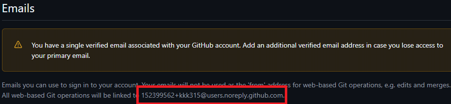

OSのクリーンインストールや新しいPCを購入した際に、GitとGitHubの連携を定期的に行うため、自分用のメモとしてGitとGitHubの連携方法をまとめました。


## 下準備
gitを設定する際にメールアドレスが必要になります。
メールアドレスは何でも良いのですが、githubにはnoreplyアドレスという何も受信しないメールアドレスが用意されているので、せっかくなのでそちらを使いましょう。  
[githubのメールアドレス確認](https://github.com/settings/emails)  
このページのこれがnoreplyアドレスです。  



## 1. Gitのインストール

今時はほとんどの環境でGitがプリインストールされていることが多いですが、念のため確認しておきましょう。

ターミナルを開き、以下のコマンドを実行します。

```bash
git --version
```
``git version 2.43.0``のようにバージョン情報が表示されれば、Gitはすでにインストールされています。

もしバージョン情報が表示されない場合は、以下の手順でインストールします。

- **Windows**: [Git for Windows](https://gitforwindows.org/) からインストーラーをダウンロードして実行します。
- **Mac**: Homebrewを使うのが簡単です。ターミナルで `brew install git` を実行します。
- **Linux (Debian/Ubuntu)**: `sudo apt install git` を実行します。


## 2. Gitの初期設定（ユーザー名とメールアドレス）


ターミナルを開き、以下のコマンドを実行してください。

自分の場合は名前をgigthubアカウント名、メールアドレスをGitHubのnoreplyアドレスに設定しています。
（リモートリポジトリへの接続は別途認証を行うため、gitの設定値をgithubの情報にする必要はありません。が、わざわざ別にする必要もありません。自由です）

```bash
git config --global user.name "名前"
git config --global user.email "メールアドレス"
```
これで、Gitがコミットを行う際に使用するユーザー名とメールアドレスが設定されます。


## 3. デフォルトブランチを`main`に変更

Gitのデフォルトブランチ名は `master` ですが、GithubやGitLabなどのリモートリポジトリのデフォルトブランチは `main` が標準となっています。ローカルのGit設定もこれに合わせておくことで、余計な混乱を避けられます。

```bash
git config --global init.defaultBranch main
```
この設定により、`git init`で新しいリポジトリを作成した際の最初のブランチ名が自動的に `main` になります。

## 4. SSH接続の設定

GitHubとの通信には主にHTTPSとSSHの2つの方法があります。
- **HTTPS**: Personal Access Token（PAT）を使用した認証が必要です。2021年8月以降、パスワード認証は廃止されました。
- **SSH**: 公開鍵と秘密鍵のペアを使って認証します。一度設定すれば、パスワードなしで安全に通信でき、非常に効率的です。

**SSH接続を推奨する理由：**
PATでは各種操作の権限や有効期限も設定できるため細かい制御が可能ですが、結局トークンの発行や再設定が面倒になって全権限付きの有効期限なしのトークンを使いがちになり、結局それじゃあSSH接続と大差ないためssh接続でやっています。

### 4-1. SSHキーペアの生成
まず、ローカルマシンでSSHキーのペア（秘密鍵と公開鍵）を作成します。
ここで設定するメールアドレスは、2.で設定したgitと同じものにしています。

```bash
# ed25519方式でキーを生成（現在推奨）
ssh-keygen -t ed25519 -C "メールアドレス"
```

実行すると、いくつか質問されます。
- **ファイルの保存場所**: 特に理由がなければEnterキーを押してデフォルトの場所 (`~/.ssh/id_ed25519`) に保存します。
- **パスフレーズ**: キーをさらに保護するためのパスワードです。鍵が漏洩してもパスがわからなければ認証できないため、堅牢性に優れます。

**パスフレーズを設定した場合**:
堅牢にはなりますが、毎回パスフレーズを求められるようになってとても使い勝手が悪いため、エージェントに登録することで毎回の入力をスキップします。

sshエージェントを起動
```bash
eval "$(ssh-agent -s)"
```

sshエージェントに秘密鍵を登録
```bash
ssh-add ~/.ssh/id_ed25519
```
この後パスフレーズを入力することで、セッション中はパスフレーズの入力をスキップすることができます。

Macの場合はキーチェーンへの登録で永続化可能です。

ご想像の通りめんどくさいのでやってません。


### 4-2. SSH公開鍵をGitHubに登録
次に、生成した「公開鍵」をGitHubアカウントに登録します。

1.  以下のコマンドで公開鍵の内容をターミナルに表示させ、その出力結果（`ssh-ed25519`で始まり、メールアドレスで終わる行全体）をすべてコピーします。

    ```bash
    cat ~/.ssh/id_ed25519.pub
    ```

2.  GitHubにログインし、(**Settings > SSH and GPG keys**)[https://github.com/settings/keys] に移動します。
3.  **New SSH key** ボタンをクリックします。
4.  **Title** には、どのPCのキーか分かるような名前（例: `MacBook Air`）を入力します。
5.  **Key** フィールドに、先ほどコピーした公開鍵の内容を貼り付け、**Add SSH key** をクリックします。

## 5. 接続確認

以下のコマンドをターミナルで実行してください。

```bash
ssh -T git@github.com
```

初めて接続する場合、以下のような確認メッセージが表示されるので `yes` と入力します。
```
Are you sure you want to continue connecting (yes/no/[fingerprint])?
```

最終的に、以下のようなメッセージが表示されれば成功です。
```
Hi あなたのユーザー名! You've successfully authenticated, but GitHub does not provide shell access.
```

これで、GitとGitHubの基本的な連携設定は完了です。
GPGキーはめんどくさいんでやりません。

