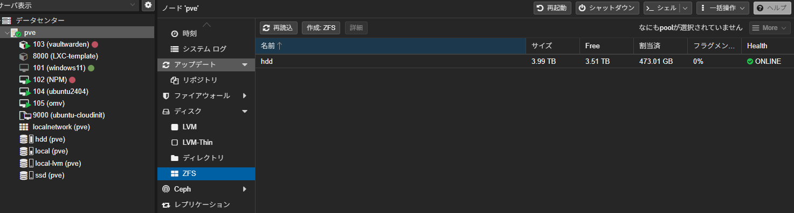
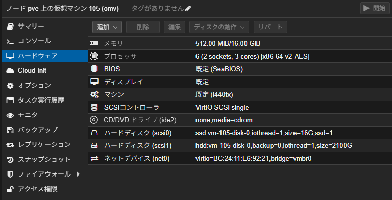
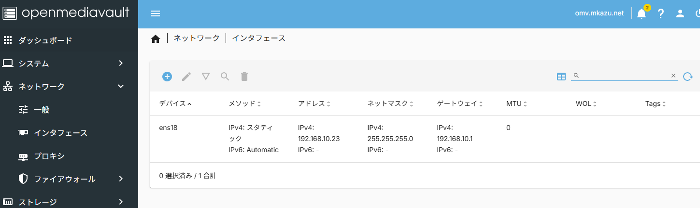
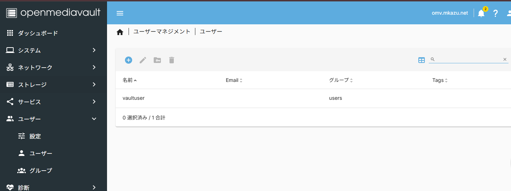
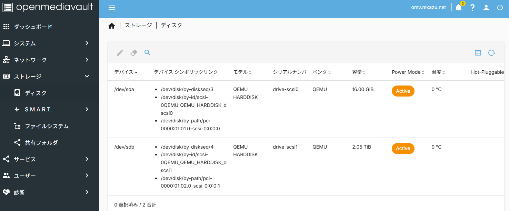
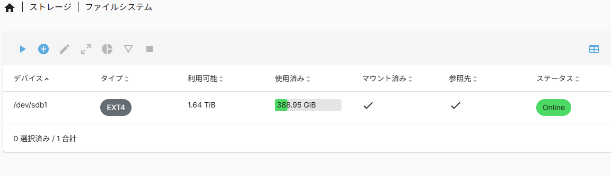
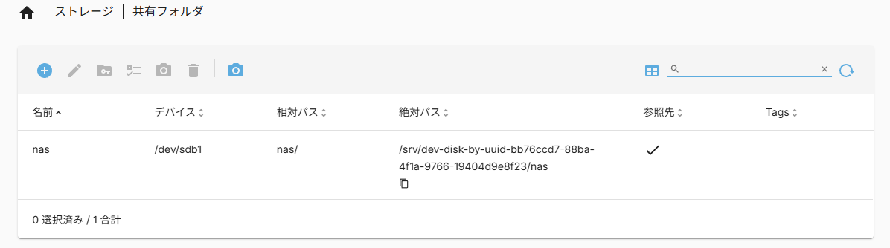
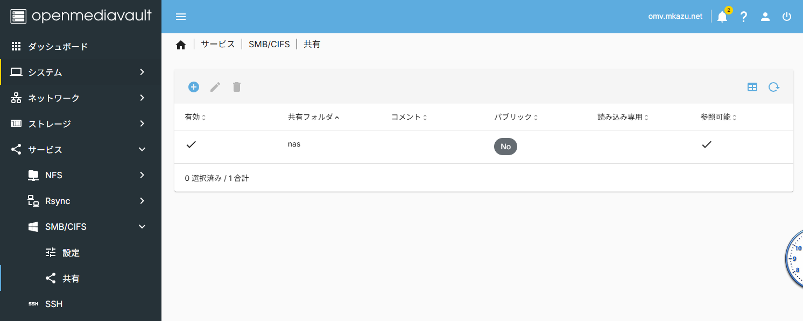
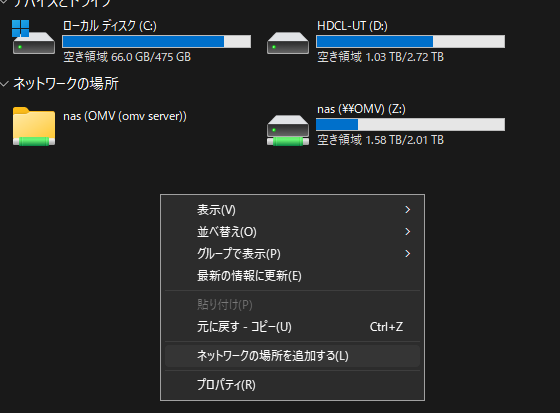
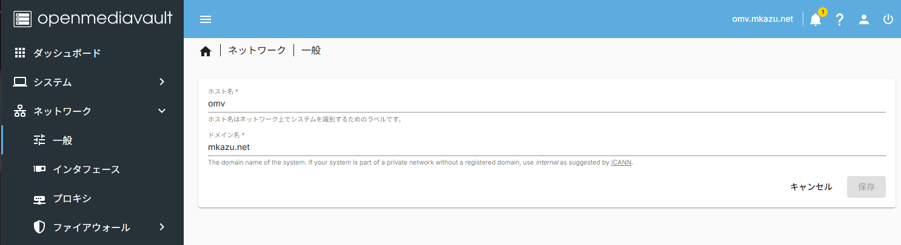

NASといえばTrueNAS、というくらい有名なTrueNASですが、よくよく調べてみれば推奨メモリが16GBだったり、インストール先がSSD推奨だったりと案外要求スペックが高かったりします。
ちょっと弱めのマシンにNASを割り当てる必要があって、ちょっとTrueNASを動かすのは無理かなと。そんな感じで少し調べた所、OpenMediaVaultというNAS用OSが中々いい感じらしいので試験的に運用していました。

[https://www.openmediavault.org/](https://www.openmediavault.org/)

TrueNASほど高性能ではないらしいですが、そもそも「一人暮らしで端末を問わずファイルにアクセスしたい」くらいのモチベーションなので性能はそこまで求める必要がありませんでした。LAN内も1Gbosなのでね。
パッケージとしてインストールしても使えるので試しやすいのも良いところ。isoも1GBないので楽ちんです。

スペック要件
||最低|推奨|おすすめ|
|CPU|32bit|64bit|2コア以上|
|ストレージ|なんでも|HDDx2|
|メモリ|1GB|4GB|8GB|
|NIC|なんでも|10Mbps|1Gでも10GでもSFPでも|

## VMの設定
1TBx4のRAID5にして、3TBのボリュームをNASの保存領域にしました。
proxmoxのノードを選択してディスク→ZFSで作成します。

※もう作ったあと

その後VMを作成して、isoから起動するよう設定し、起動ディスクを別のボリュームに、追加で保存領域をマウントします。
保存領域の方はOMVの方でマウントしますので、インストール用に別の小さい領域を新規で作るようにしてください。

インストールはOSがdebianベースなので特に問題なく進むと思います。

## NASの設定
インストール完了後、ブラウザでVMのIP、またはインストール時に設定したコンピュータの``名前.ホスト名``にアクセスすることでログイン画面が表示されます。
アカウント名： ``admin``
パスワード: ``openmediavault``
でログインします。
### ネットワーク設定
うちの環境ではネットワーク設定が自動で行われてDHCPでIPが振られてしまったので、ネットワークから別のIPで固定します。自宅内でしか使わない、でも常時起動しておくって場合は変えなくて大丈夫だと思います。たまにしか起動しない場合はリース時にIPが変わる・ダウン中に繋いだ新規のデバイスにIPを重複して配信されるとかの可能性があるので設定したほうがいいでしょう。
こんな感じで設定しました。

ゲートウェイはルータのアドレス、DNSも特に内部で立てていなければルータのアドレスを指定します。

設定しない場合は、コンソールから``ip a``などでIPアドレスを確認します。

### ユーザー作成
ネットワークストレージとしてマウントする時用にユーザーを作っておきます。adminではあれなので。
名前とパスワードだけでOKです。
シェルはログインする必要がないので、nologinを選びました。

### ボリューム作成、共有
その後、ストレージ→ディスクで保存領域のボリュームをマウント（このためOS自体は別の小さいディスクを指定しました）

ファイルシステムでマウントしたボリュームにファイルシステムを作成（EXT4にしました）

共有フォルダでNAS用のフォルダを作ります。

最後に、SMBの設定で共有フォルダを指定します。サービス→SMB/CIFS→共有

ここまでおわったら、windowsならPCのドライブのところで右クリック→「ネットワークの場所を追加する」で``http://OMVのアドレス/<共有フォルダ名>``を指定すれば中身が見えるようになるかと思います。

OMVのアドレスは設定画面を開いたときの名前.ホスト名です。IPを固定した場合はIPアドレスでも大丈夫です。
（ネットワーク→一般で確認できます）

### おわり
以上で設定は完了です。パフォーマンスとしては本当にザ・保管庫という感じですが、今使っている外付けHDDが15年モノなので避難場所として活用していきます。

残りの1TB弱の領域はあとでnextcloudで使おうかなと思ったり思わなかったり。