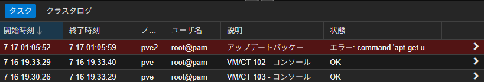

自宅にProxmox VEを立ててから１週間、ちらちらと見えていたアップデートエラーに対処しました。


> TASK ERROR: command 'apt-get update' failed: exit code 100
これが出る原因ですが、有料サブスクリプションがないにも関わらず、有料サブスクリプション向けのリポジトリを含めてアップデートをかけようとしているからでした。

以下の設定でエラーが出ているので、この記述を無効にしていきます。

```bash
deb https://enterprise.proxmox.com/debian/pve bookworm pve-enterprise
```

``/etc/apt/sources.list``及び``/etc/apt/sources.list.d/``内に件の設定がどこかしらにあるため、それらをコメントアウトまたは削除します。

まずは基本の設定ファイルから。
nanoなりviなりで``/etc/apt/sources.list``を開き、以下のようにコメントアウトしておきます。
(面倒なのでwebUIのシェルからrootでやっていますが、一般ユーザーでやる場合はsudoが必要かも)

```bash
nano /etc/apt/sources.list

deb http://ftp.jp.debian.org/debian bookworm main contrib

deb http://ftp.jp.debian.org/debian bookworm-updates main contrib

# security updates
deb http://security.debian.org bookworm-security main contrib
deb http://ftp.debian.org/debian bookworm-backports main contrib
deb http://download.proxmox.com/debian/pve bookworm pve-no-subscription
#deb https://enterprise.proxmox.com/debian/pve bookworm pve-enterprise ←こいつをコメントアウト
a
```


次に``/etc/apt/sources.list.d/``ですが、こちらはディレクトリなので、まずはどんなファイルがあるか確認します。

```bash
ls /etc/apt/sources.list.d/
ceph.list  pve-enterprise.list
```

自分の環境では``ceph.list``と``pve-enterprise.list``がありました。
Cephについてはproxmoxインストール後、初めてwebUIにログインしたらCephの項目があったため、「おっ使えるじゃん」とインストールボタンを押したため作成された模様です。（使えなかった）
どちらも同じ要領でコメントアウトします。

あとはしばらくすれば勝手にアップデートを行ってくれます。
