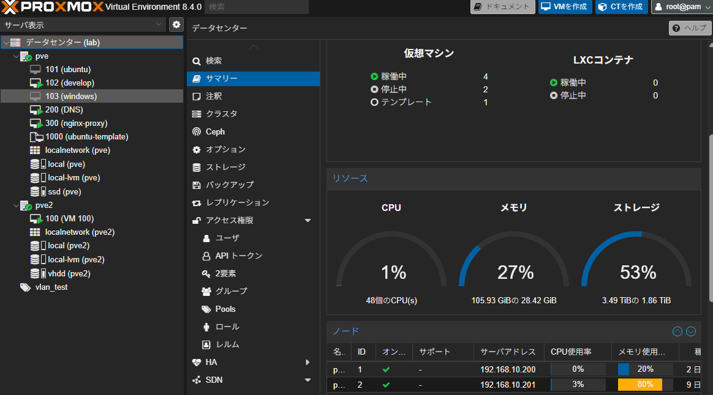

## 最近回線を契約したらIPoEとかいう方式だった
IPv6の通信では今までのPPPoEに変わり、IPoEという方式で通信しています。これまではISP各社が自前で用意していた網終端装置を経由することで混雑していたPPPoE方式ですが、IPoEの場合は網終端装置の代わりにVNE事業者の大容量ゲートウェイを経由してインターネットにアクセスできるため、時間帯による混雑が解消されています。VNE事業者はIPv6用の強力な設備を各ISPに貸し付ける感じの事業者で、ISPはそれを借りてIPv6の接続サービスを提供しています。イメージ的には光ファイバー版MVNOみたいな感じでしょうか。
IPoEのサービスに関しては各ISPごとにいろいろな名前が付けられていますが、方式としてはMAP-E,DS-Lite,IPIPの3種類のいずれかになります。

### IPoE IPv6 over IPv4 トンネリング
IPoEによるIPv6網でIPv4の通信をするために、IPv6パケットにIPv4のパケットを埋め込むことを「IPv6 over IPv4 トンネリング」といいます。これ自体はシンプルにIPv4の通信もできて便利、という位置付けです。  
先程挙げた3つの方式も、基本的にはIPv4をトンネルするための技術ですが、問題はその思想です。  
MAP-E,DS-LiteはIPv4枯渇問題に対処すべく、一つのグローバルIPアドレスに対してNAPTのような機能をもち、この機能のためIPv4のグローバルIPアドレスは複数のユーザーが共有することになっています。このため、共有しているユーザーが自由にポートを操作できないという制約が存在します。  
これに対してIPIPは「IP in IP」という、IPv6だろうがIPv4だろうが何でもカプセル化する技術で、これ自体はPPPoE時代と同じく専用のグローバルIPアドレスを占有することになります。カプセル化のみの技術であり、逆に言えば枯渇対策をしておらず、他の2つのようなグローバルIPアドレスに対してポートマッピングをしないということです。

### MAP-E
MAP-Eはユーザーごとにある程度の範囲でポートを分割し、それを固定してくれる方式です。割り当てられたポートの範囲内なら操作できますが、Webサーバー（80番、443番）などのウェルノウンポートは使えません。

### DS-Lite
DS-Liteはポートマッピング自体がその都度動的に行われるので、まさにNAPTのような動きです。ポートが固定で割り当てられるわけではないので、開放自体ができません。

### IPIP
固定IPを契約するなら基本的にこの方式です。今までのIPv4と同じ感覚で使えます。

## 結局
うちの回線は1Gbps契約ですし、そこまで本気でサービスを公開するつもりもないので、混雑時間は割り切ってPPPoEでつなげることにしました（インターリンクで月額1320円）。
月2200円でIPIPの固定IPプランもあったんですが、とりあえず無料期間もあるので実際に試してみてあとで決めようと思います。

これからDNSの設定をして、いろいろ公開していこうと思います。

ちなみに現在はBIGLOBEとインターリンクの2セッションで動いているわけですが、IPv4のサイトはどちらか固定ではなく、恐らく経路上いい感じの方が繋がるようで、IP確認みたいなサイトでも固定のほうとそうでない方の両方が見えました。

---
おまけ  
今のサーバーの状況です。
